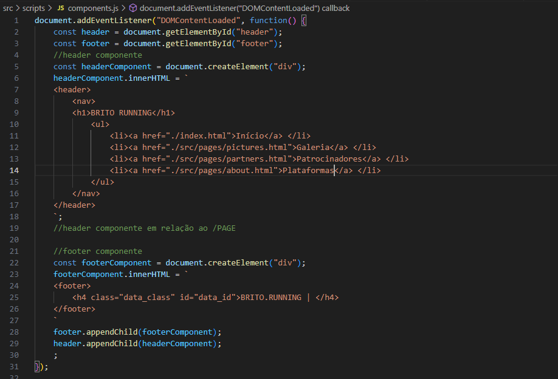

<h1>Brito.running</h1>
<h3>Foram utilizados HTML, CSS e Javascript</h3>

Em relação ao Javascript foram utilizados funções para coletar o ano atual e demonstra-lo no footer do site
 

Também foram criados espécies de "Componentes" do Header e Footer através do Javascipt, utilizando "InnerHTML" e os "Id's" do HTML 
 

Print do código

Também foram utilizadas funções Javascript para a movimentação no site, e para a troca de imagem que ocorre no menu do site por meio de um clique ("Onclick")

